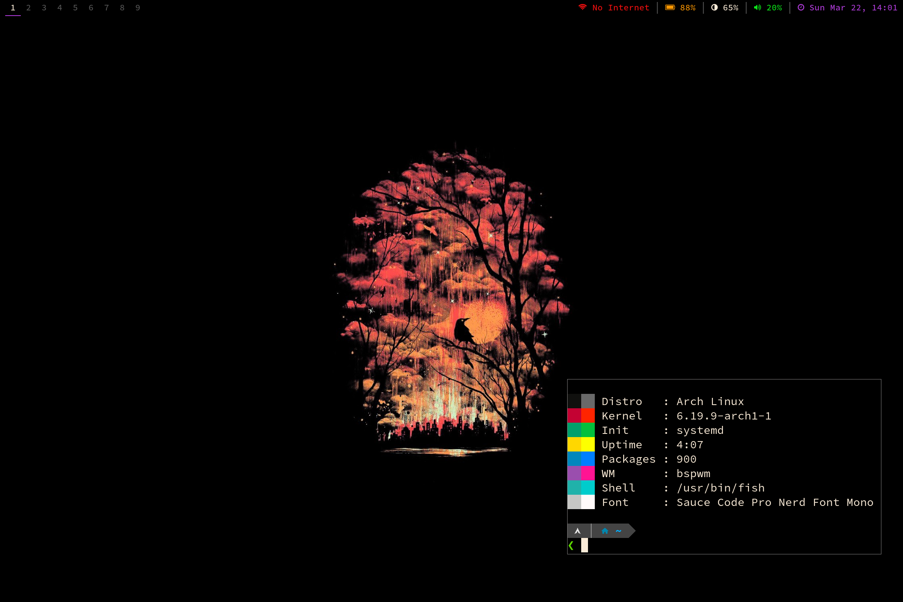

# framedots

These are my personal notes & dotfile configs for running Arch Linux on a Framework Laptop 13 (Intel Core Ultra 7). Forked from my [T480 dotfiles](https://github.com/vesche/t480) repo.

I run a somewhat minimal setup: x, bspwm, sxhkd, dmenu, polybar, alacritty, fish.

* [Install notes](./Install_notes.md)
* [dotfiles](./dots)
* [Random Notes](./Random_notes.md)

